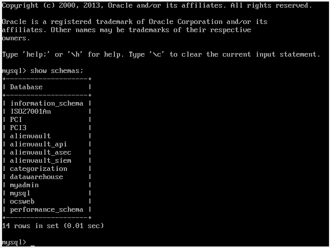
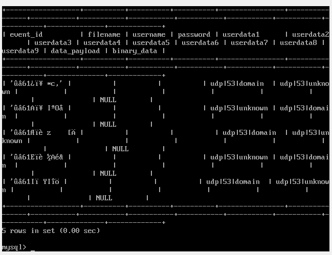
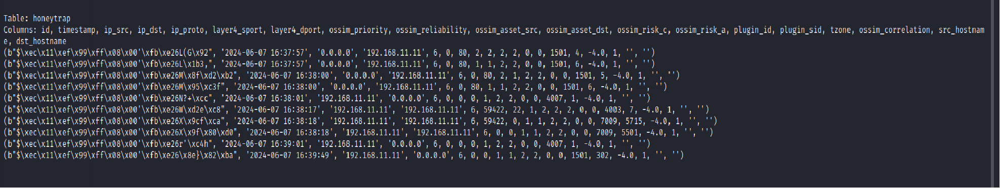

# HoneyTrap
HoneyTrap is a cybersecurity system used to trap, get, and analyze attacker data. Depends on the integration of SIEM solutions and the Honeypot system.
Honeypots are a system that is built and configured in order to be hacked, so they
are deployed within the system in order to help consume the attacker's resources,
exploit his time, and divert his attention away from the systems.
It also provides a working environment for studying the techniques and methods
used by attackers on the system.
It is important to monitor all activities in this area, and by definition, every activity
in this area is an attack.
# Here are some of the key motivations that led to the development of the honeytrap:
1. Threat Detection and Analysis
2. Incident Response and Forensics
3. Research and Threat Intelligence
4. Vulnerability Identification
5. Training and Skill Development

# DATA
## Phases of manipulating the data:
1. searching for the data sources
2. data access and authorization
3. data extraction
4. data exploration
5. data selection
6. data preprocessing: [ETL , Data cleaning and Web scraping]
7. data syncronization
8. data visualization
